### 简单供应链的实现

简单供应链主要有三种角色：

1. 管理员

   管理员负责供应链的创建，包括 Account 账户表的创建、Bill 账单表的创建、enterprise 企业的加入、institution 机构的加入，其中前两者在创建供应链时顺便在服务器端直接完成，因此主要是实现后两者的功能。

   **链端关于加入账户的有关接口为**

   > call  SupplyChain  latest  insertAccountTable  [id]  [name]  [role]  [credit]

   涉及四个**参数**，分别是

   | 参数   | 说明                                                       |
   | ------ | ---------------------------------------------------------- |
   | id     | 加入的企业或机构的账户地址                                 |
   | name   | 加入的企业或机构的名字                                     |
   | role   | 加入的是企业或机构，取值只有 "enterprise" 和 "institution" |
   | credit | 加入的企业或机构的初始信用分，取值一般可以默认为 60        |

   **返回值**说明：

   + -1 表明存在重复的 id，因此账户加入失败
   + -2 表明存在重复的 name，因此账户加入失败

   **需求**为，管理员进入系统后，提供一个按钮，名为 "加入新账户"，而后提供表单，填写 id、name、role、credit 四个内容并提交，其中主要限制要求有

   + id 要求为以 "0x" 为前缀，后跟 40 位数字（16 进制，0 - 9 及 a - f）的形式
   + name 要求不含空格
   + role 要求从 "enterprise" 和 "institution" 中二选一
   + credit 要求取值整数 0 - 100
   
2. 企业

   企业有签发、转让、融资、支付的功能，四者都需要实现。

   **链端关于签发的有关接口为**

   > call  SupplyChain  latest  sign  [lender]  [witness]  [amount]  [duration]

   涉及四个**参数**，分别是

   | 参数     | 说明                 |
   | -------- | -------------------- |
   | lender   | 被借款方的账户地址   |
   | witness  | 见证机构的账户地址   |
   | amount   | 借款金额             |
   | duration | 借款时长，以天为单位 |

   **返回值**说明：

   + -1 表明 borrower 不存在，在这里即发起这个签发操作的账户并没有加入供应链
   + -2 表明 lender 不存在
   + -3 表明 witness 不存在
   + -4 表明 borrower 不是企业，在这里即发起这个签发操作的账户并非企业，无权签发
   + -5 表明 lender 不是企业
   + -6 表明 witness 不是机构
   + -7 表明 borrower 信用分不足，在这里即发起这个签发操作的账户信用分不足以支持其签发

   **需求为**，企业进入系统后，提供一个按钮，名为 "签发"，而后提供表单，填写 lender、witness、amount、duration 四个内容并提交，其中主要限制要求有

   + lender 要求从供应链上的企业列表中选择得到
   + witness 要求从供应链上的机构列表中选择得到
   + amount 要求是正整数
   + duration 要求是正整数

   ****

   **链端关于转让的有关接口为**

   > call  SupplyChain  latest  transfer  [receiver]  [amount]

   涉及两个**参数**，分别是

   | 参数     | 说明             |
   | -------- | ---------------- |
   | receiver | 接收方的账户地址 |
   | amount   | 转让金额         |

   **返回值**说明：

   + -1 表明 sender 不存在，在这里即发起这个转让操作的账户并没有加入供应链
   + -2 表明 receiver 不存在
   + -3 表明 sender 不是企业，在这里即发起这个转让操作的账户并非企业，无权转让
   + -4 表明 receiver 不是企业
   + -5 表明 sender 资产不够转让，在这里即发起这个转让操作的账户资产不足以支持其转让

   **需求**为，企业进入系统后，提供一个按钮，名为 "转让"，而后提供表单，填写 receiver、amount 两个内容并提交，其中主要限制要求有

   + receiver 要求从供应链上的企业列表中选择得到
   + amount 要求是正整数

   ****

   **链端关于融资的有关接口为**

   > call  SupplyChain  latest  financing  [institution]  [amount]

   涉及两个**参数**，分别是

   | 参数        | 说明           |
   | ----------- | -------------- |
   | institution | 机构的账户地址 |
   | amount      | 转让金额       |

   **返回值**说明：

   + -1 表明 enterprise 不存在，在这里即发起这个融资操作的账户并没有加入供应链
   + -2 表明 institution 不存在
   + -3 表明 enterprise 不是企业，在这里即发起这个融资操作的账户并非企业，无权融资
   + -4 表明 institution 不是机构
   + -5 表明 enterprise 资产不够融资，在这里即发起这个融资操作的账户资产不足以支持其融资

   **需求**为，企业进入系统后，提供一个按钮，名为 "转让"，而后提供表单，填写 institution、amount 两个内容并提交，其中主要限制要求有

   + institution 要求从供应链上的机构列表中选择得到
   + amount 要求是正整数

   ****

   **链端关于支付的有关接口为**

   > call  SupplyChain  latest  pay  [lender]  [witness]  [timestamp]  [deadline]

   涉及四个**参数**，分别是

   | 参数      | 说明               |
   | --------- | ------------------ |
   | lender    | 被借款方的账户地址 |
   | witness   | 见证机构的账户地址 |
   | timestamp | 账单的时间戳       |
   | deadline  | 账单的期限时间     |

   **返回值**说明：

   + 暂无

   **需求**为，企业进入系统后，提供一个按钮，名为 "支付"，而后提供表单，填写 lender、witness、timestamp、deadline两个内容并提交（应该是列出所有账单供其选择），其中主要限制要求有

   + lender 要求从供应链上的企业列表中选择得到
   + witness 要求从供应链上的机构列表中选择得到
   + timestamp 要求从时间转化过来（事实上实现应该不是这样的）
   + deadline 要求从时间转化过来（事实上实现应该不是这样）

   上面的说的实现，应该是列出账单然后选择，这样就不用天表单了。

3. 机构

   照理来说，机构是需要确认是否批准某一签发操作以及是否确认某一支付操作已到账的，暂时没写，可能目前就只是简单地查看一下自己拥有的账单吧。

### 大致的样子

1. 管理员登陆进去

   

2. 企业登陆进去

   

3. 机构登陆进去

   暂无

### 需要参考的资料

[Node.js SDK](https://fisco-bcos-documentation.readthedocs.io/zh_CN/latest/docs/sdk/nodejs_sdk/install.html)

[Node.js API 官方文档版本](https://fisco-bcos-documentation.readthedocs.io/zh_CN/latest/docs/sdk/nodejs_sdk/api.html)

[Node.js API 官方 github 版本](https://github.com/FISCO-BCOS/nodejs-sdk)

### 补充信息写这下面


+ 2021.01.24

  + 原来的智能合约我给改了，现在上面的版本我还没测试，可能有 bug

  + Node.js 我试了一下，我不太会用，大概像这样用？

    ```javascript
    const Configuration = require('/home/slippersss/win10/blockchain/lab/nodejs-sdk/packages/api').Configuration;
    const Web3jService = require('/home/slippersss/win10/blockchain/lab/nodejs-sdk/packages/api').Web3jService;
    
    console.log('Begin testing');
    
    const configuration = new Configuration('/home/slippersss/win10/blockchain/lab/nodejs-sdk/packages/cli/conf/config.json');
    
    const web3jService = new Web3jService(configuration)
    
    web3jService.getBlockNumber().then((result) => {
        result.result = parseInt(result.result, '16').toString();
        console.log(result);
    });
    ```

  + 安装那个 SDK 还有点问题，我还没怎么看懂