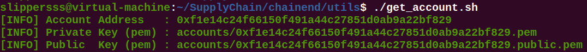
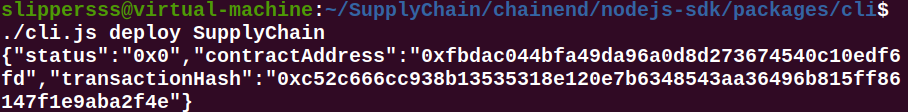
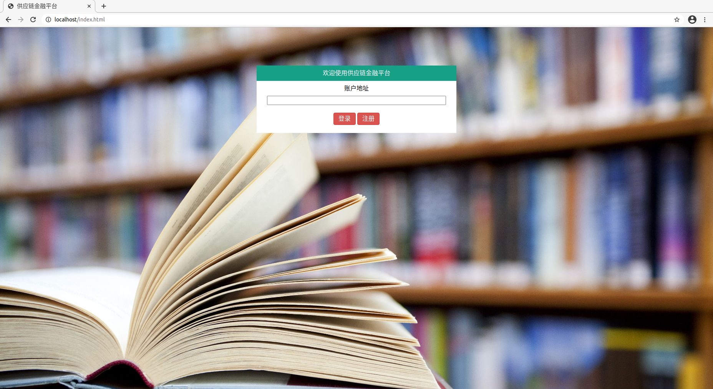
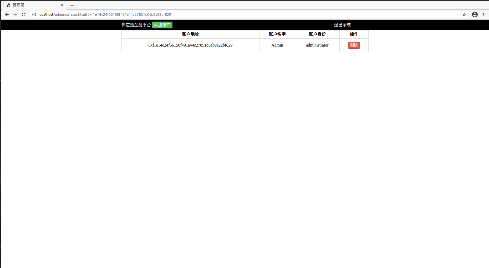

# 文件组织

| 名字                                                      | 用途                                                         |
| --------------------------------------------------------- | ------------------------------------------------------------ |
| src                                                       | 编写的链端、后端、前端代码                                   |
| fisco                                                     | 热身阶段搭建的联盟链                                         |
| SupplyChain                                               | 报告中演示搭建的供应链，大概率不能直接运行，请按照下面的部署方法自行部署 |
| 供应链实验报告.pdf                                        | 此次实验报告                                                 |
| 18340097_18340100_18340105_项目设计说明及功能测试文档.pdf | 设计与测试阶段实验报告（上一阶段）                           |
| 视频演示.mp4                                              | 视频演示供应链的基本用法，由于时间有限，其中操作有限，实际使用还有其他功能和错误检测 |

# 供应链部署

我们使用的环境是 Ubuntu 20.04，要求安装有 nodejs 与 npm 等工具，具体参考[这个网址](https://fisco-bcos-documentation.readthedocs.io/zh_CN/latest/docs/sdk/nodejs_sdk/install.html)进行环境搭建。另外，此处部署的前提要求是在热身阶段已经完成单群组 FISCO-BCOS联盟链的搭建，若还没有搭建，可以参考[这个网址](https://fisco-bcos-documentation.readthedocs.io/zh_CN/latest/docs/installation.html)进行搭建。

### 1. 整体目录

以 SupplyChain 为名的目录为基础，其中含有 chainend、backend、frontend 三个目录，即

```
.
├── backend
├── chainend
└── frontend
```

### 2. 拷贝 nodes 目录

在热身阶段已经完成单群组 FISCO-BCOS联盟链的搭建中，有目录 ~/fisco/nodes 目录，包含节点信息，将其拷贝到 ./chained 中，如下

```
.
├── backend
├── chainend
│   └── nodes
└── frontend
```

### 3. 下载 nodejs SDK

在 ./chained 目录下，根据[这个网址](https://fisco-bcos-documentation.readthedocs.io/zh_CN/latest/docs/installation.html)下载 nodejs SDK，并按照指引安装依赖项等，即

```shell
git clone https://github.com/FISCO-BCOS/nodejs-sdk.git
npm config set registry https://registry.npm.taobao.org
cd nodejs-sdk
npm install
npm run repoclean
npm run bootstrap
```

完成后如下

```
.
├── backend
├── chainend
│   ├── nodejs-sdk
│   └── nodes
└── frontend
```

### 4. 配置证书和端口

在热身阶段已经完成单群组 FISCO-BCOS联盟链的搭建中，有目录 ~/fisco/console/conf 目录，包含所需的证书，将其拷贝到 ./chainend/nodejs-sdk/packages/cli/conf/authentication 中，如下

```shell
cp ~/fisco/console/conf/sdk.key ~/fisco/console/conf/sdk.crt ~/fisco/console/conf/ca.crt ./chainend/nodejssdk/packages/cli/conf/authentication/
```

完成后如下

```
./chainend/nodejs-sdk/packages/cli/conf/authentication
├── ca.crt
├── sdk.crt
└── sdk.key
```

同时打开 ./chainend/nodejs-sdk/packages/cli/conf/confjg.json 文件，根据自己的搭建的链的情况修改 "nodes" 项，若是按照热身阶段搭建的联盟链，则可以按照下面修改

```json
...
"nodes": [
        {
            "ip": "127.0.0.1",
            "port": "20200"
        },
        {
            "ip": "127.0.0.1",
            "port": "20201"
        },
        {
            "ip": "127.0.0.1",
            "port": "20202"
        },
        {
            "ip": "127.0.0.1",
            "port": "20203"
        },
        {
            "ip": "127.0.0.1",
            "port": "20204"
        }
    ],
...
```

其中 config.json 还有账户的设置，默认下，启用 ndejs SDK 自带控制台会启动这里面的第一个账户 alice，我们可以自己设置账户名为 Admin，以之为管理员加入其中，由于是管理员，且搭建初期需要用控制台来操作，因此需要将 Admin 放在第一个位置，如下

```json
{
    "encryptType": "ECDSA",
    "accounts": {
        "Admin": {
            "type": "pem",
            "value": "./accounts/Admin.pem"
        },
        "alice": {
            "type": "pem",
            "value": "./accounts/alice.pem"
        },
        "bob": {
            "type": "pem",
            "value": "./accounts/bob.pem"
        },
        "cherry": {
            "type": "p12",
            "value": "./accounts/cherry.p12",
            "password": "123456"
        }
    },
...
```

同时要将使用 get_account.sh 生成的管理员账户的 .pem 文件重命名为 Admin.pem 并移动至 ./chainend/nodejs-sdk/packages/cli/conf/accounts 下，具体步骤参考下面的教程。

### 5. 完善工具包

链端操作需要用到四个工具，分别是 get_account.sh、register_account.sh、login_account.sh 和 keccak-256sum，其中 get_account.sh 可以在 ~/fisco/console 目录下取得，register_account.sh 和 login_account.sh 是我们自己编写的，前者是对 get_account.sh 进行包装，后者是登陆账户判断，而 keccak-256sum 可以在[这个网址](https://github.com/vkobel/ethereum-generate-wallet/tree/master/lib)下载得到。将这三个工具置于 ./chainend/utils 中，完成后如下

```
./chainend/utils
├── get_account.sh
├── keccak-256sum
└── login_account.sh
```

由于前期操作需要管理员，我们直接在 ./chainend/utils 目录下执行 get_account.sh，在同目录下的 accounts 中获得第一个账户，如下



将其对应的 .pem 和 .public.pem 重命名为 Admin.pem 和 Admin.public.pem（原来的 0x... 需要记住，后面会用到，即账户地址），并移动到 ./chainend/nodejs-sdk/packages/cli/conf/accounts 目录下（后续在前端注册账户，register_account.sh 会自动将账户移动到这个目录下，需要更名请到此目录下寻找账户）

### 6. 将对应文件放置到对应位置

将 SupplyChain.sol 和 Table.sol 移动至 ./chainend/nodejs-sdk/packages/cli/contracts 目录下，将 index.js 移动至 ./backend 目录下，将 *.html 和 css、js、image 目录移动至 ./frontend 目录下，完成如下

```
.
├── backend
│   └── index.js
├── chainend
│   ├── nodejs-sdk
│   │   ├── CHANGELOG.md
│   │   ├── lerna.json
│   │   ├── LICENSE
│   │   ├── node_modules
│   │   ├── package.json
│   │   ├── package-lock.json
│   │   ├── packages
│   │   ├── README.md
│   │   └── test
│   ├── nodes
│   │   ├── 127.0.0.1
│   │   └── cert
│   └── utils
│       ├── accounts
│       ├── get_account.sh
│       ├── keccak-256sum
│       ├── login_account.sh
│       └── register_account.sh
└── frontend
    ├── administrator.html
    ├── css
    │   ├── administrator.css
    │   ├── enterprise.css
    │   ├── index.css
    │   ├── institution.css
    │   └── simplecss.css
    ├── enterprise.html
    ├── images
    │   └── bg2.jpg
    ├── index.html
    ├── institution.html
    └── js
        └── ajax.js
```

### 7. 使用 cli 进行初期搭建

进入 ./chainend/nodes/127.0.0.1，运行 start_all.sh 脚本启动节点，再进入 ./chainend/nodejs-sdk/packages/cli 目录，在这个目录下准备使用 cli.js 进行一些操作。

1. 部署智能合约 SupplyChain

   ```shell
   ./cli.js deploy SupplyChain
   ```

   结果如下

   

   记录下输出中的 contractAddress，并打开 ~/SupplyChain/backend/index.js 文件，修改其中第十行代码的 contract 变量为这个 contractAddress，即

   ```javascript
   const contract = "0xfbdac044bfa49da96a0d8d273674540c10edf6fd"; // Need to be modified
   ```

2. 创建各个表

   通过智能合约创建数据库中的各个表，如下

   ```shell
   ./cli.js call SupplyChain 0xfbdac044bfa49da96a0d8d273674540c10edf6fd createAccountTable
   ./cli.js call SupplyChain 0xfbdac044bfa49da96a0d8d273674540c10edf6fd createPendTable
   ./cli.js call SupplyChain 0xfbdac044bfa49da96a0d8d273674540c10edf6fd createBillTable
   ```

3. 将 Admin 加入到 Account 表

   由于启动网页至少需要有管理员，因此管理员需要手动将自己加入 Account 表，如下

   ```shell
   ./cli.js sql 'insert into Account(foobar, id, name, role, credit) values("idot", "0xf1e14c24f66150f491a44c27851d0ab9a22bf829", "Admin", "administrator", "100")'
   ```

   这里 values 中的 id 值是前面申请管理员账户时的地址。

### 8. 开始监听

进入 ~/SupplyChain/backend，运行

```shell
sudo node index.js
```

而后打开网页就可以开始使用了，打开效果如下

|  |  |
| ------------------------------------------------------------ | ------------------------------------------------------------ |
| 开始页面                                                     | 管理员页面                                                   |

# 实验分工

| 学号     | 姓名   | 工作分配                                                   |
| -------- | ------ | ---------------------------------------------------------- |
| 18340097 | 李岩   | 功能测试与项目设计，部分代码编写，主要设计整体 UI 33%      |
| 18340100 | 李泽桐 | 项目设计与代码编写，部分报告编写，主要攻克链端和后端 33.5  |
| 18340105 | 廖家源 | 代码编写与功能测试，部分项目设计，主要功课后端和前端 33.5% |